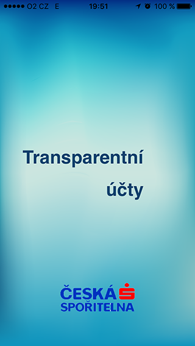
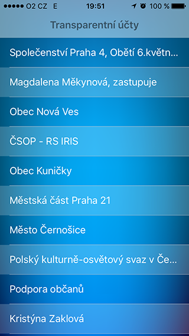
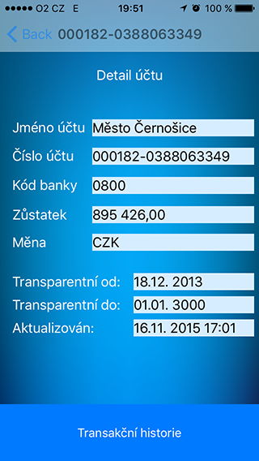
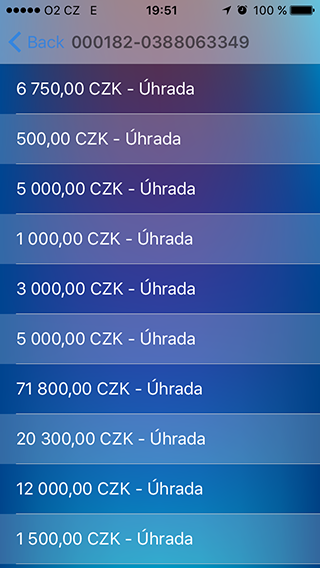

TransAcc is an iPhone app for test purposes written in Swift.

## Features

- [x] Download transparent account list
- [x] View transparent account detail
- [x] View list of transactions
- [x] [Connected to Ceska sporitelna a.s. API Portal] (https://developers.csas.cz/html/devs/transparent-accounts.html)

## Requirements

- iOS 8.0+ / Mac OS X 10.9+ / tvOS 9.0+ / watchOS 2.0+
- Xcode 7.1+

## Migration Guides

- 
- 

## Communication

- via wifi or data network 

## Installation

> **Embedded project file and require a minimum deployment target of iOS 8 or OS X Mavericks (10.9).**
>
> no longer supported on iOS 7 


### Manually

Just download and learn

### Current screens









#### Embedded Framework

- future will be Alamofire


## Usage

### Making a Request

```swift


CS a.s. API portal (.GET, "https://developers.csas.cz/html/devs/transparent-accounts.html")
```

### Response Handling


## FAQ

### What's the origin of purpose?

Test jobs positions candidate 

---

## Credits

TransAcc is owned and maintained by Yogaboy 

### Security Disclosure

If you believe you have identified a security vulnerability with TransAcc, you should report it as soon as possible via email to CS a.s. Please do not post it to a public issue tracker.

## License


